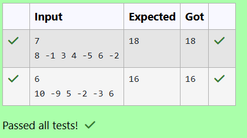

# EX 4A Kadane's Algorithm - Dynamic Programming. 
## DATE: 19/10/2025
## AIM:
To Write a Java program to solve the below problem using Kadane's Algorithm.
A solar company installs solar panels around a circular grid of n buildings. Each building either generates or consumes net energy, represented by integers (+ve for generated, -ve for consumed).

The company wants to find a contiguous sequence of buildings (possibly wrapping around from the end to the beginning) that maximizes the total net energy.

Write a program to compute the maximum net energy that can be collected from any contiguous block of buildings on the circular grid.

Input Format:
First line: Integer n (number of buildings)

Second line: n space-separated integers: net energy for each building

Output Format:
A single integer: Maximum net energy collectable from a contiguous block (wrapping allowed)

Constraints:
1 <= n <= 10^6
## Algorithm
1. Start the program.
2. Use Kadane’s algorithm to find the maximum subarray sum in the linear array and the minimum subarray sum simultaneously while computing the total sum.
3. If all elements are negative, return the maximum (least negative) subarray sum directly.
4. Otherwise, compute the circular maximum as total − minimum subarray sum and return the larger of the linear and circular maximum values. 
5. End the program.

## Program:
```
/*
Program to implement Reverse a String
Developed by: HARINI R
Register Number: 212223100010
*/

import java.util.*;

public class SolarEnergyMaximizer {

    public static int maxCircularEnergy(int[] energy)     {
        //Type your code
        int n=energy.length;
        long tot=0;
        long maxend=Long.MIN_VALUE;
        long maxfar=Long.MIN_VALUE;
        long minend=Long.MAX_VALUE;
        long minfar=Long.MAX_VALUE;
        tot=energy[0];
        maxend=energy[0];
        maxfar=energy[0];
        minend=energy[0];
        minfar=energy[0];
        for(int i=1;i<n;i++)
        {
            long val=energy[i];
            maxend=Math.max(val,maxend+val);
            maxfar=Math.max(maxend,maxfar);
            minend=Math.min(val,minend+val);
            minfar=Math.min(minend,minfar);
            tot+=val;
        }
        if(maxfar<0)
        {
            return (int)maxfar;
        }
        long wrapmax=tot-minfar;
        return (int)(Math.max(maxfar,wrapmax));
    }

    public static void main(String[] args) {
        Scanner sc = new Scanner(System.in);
        int n = sc.nextInt();
        int[] energy = new int[n];
        for (int i = 0; i < n; i++) {
            energy[i] = sc.nextInt();
        }
        System.out.println(maxCircularEnergy(energy));
    }
}
```

## Output:



## Result:
The program successfully Implemented and the output is verified. 
