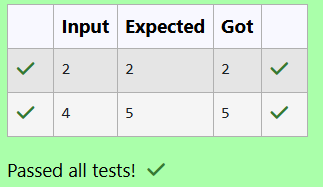

# EX 4B Frog Jump - Dynamic Programming.
## DATE: 21/10/2025
## AIM:
To write a Java program to for given constraints.
A Frog Jump 1 or 2 steps at a time.
Problem Statement:

A frog is at the bottom of the stairs with n steps. It can jump either 1 or 2 steps at a time. Write a program to find the number of distinct ways the frog can reach the top (n-th step).

Input Format:

A single integer n (1 ≤ n ≤ 45) – number of steps.
 Output Format:

A single integer – number of distinct ways to reach step n.

## Algorithm
1. Start the program.
2. Handle base cases for n = 0, 1, and 2 directly since they have fixed numbers of ways.
3. Create a DP array where each entry stores the number of ways to reach that step using the recurrence: ways[i] = ways[i−1] + ways[i−2].
4. Fill the DP array iteratively from step 3 to n and return the final value DP[n]. 
5. End the program.  

## Program:
```
/*
Program to implement Reverse a String
Developed by: HARINI R
Register Number: 212223100010 
*/

import java.util.Scanner;

public class FrogJump {
    public static void main(String[] args) {
        Scanner scanner = new Scanner(System.in);
        
       
        int n = scanner.nextInt();
        scanner.close();

        System.out.println(countWays(n));
    }

   
    public static int countWays(int n) {
        //Type your code here
        if(n==0) return 0;
        if(n==1) return 1;
        if(n==2) return 2;
        int[] dp=new int[n+1];
        dp[0]=0;
        dp[1]=1;
        dp[2]=2;
        for(int i=3;i<=n;i++)
        {
            dp[i]=dp[i-1]+dp[i-2];
        }
        return dp[n];
    }
}
```

## Output:



## Result:
The program successfully implemented and the expected output is verified.
