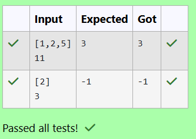

# EX 4C Coin Change Problem - Dynamic Programming.
## DATE: 24/10/2025
## AIM:
To write a Java program to for given constraints.
You are given an integer array coins representing coins of different denominations and an integer amount representing a total amount of money.

Return the fewest number of coins that you need to make up that amount. If that amount of money cannot be made up by any combination of the coins, return -1.

You may assume that you have an infinite number of each kind of coin.

## Algorithm
1. Start the program.
2. Initialize a DP array of size amount+1 with a large value and set dp[0] = 0 to represent zero coins needed for amount 0.
3. For every amount from 1 to target, try each coin and update dp[i] as the minimum of its current value and dp[i − coin] + 1.
4. After filling the DP table, return dp[amount] if it's valid; otherwise return −1 if no combination can form the amount. 
5. End the program.  

## Program:
```
/*
Program to implement Reverse a String
Developed by: HARINI R
Register Number: 212223100010
*/

import java.util.*;

public class Solution {
    public int coinChange(int[] coins, int amount) {
        //ADD YOUR CODE HERE
        int[] dp=new int[amount+1];
        Arrays.fill(dp,amount+1);
        dp[0]=0;
        for(int i=1;i<=amount;i++)
        {
            for(int j:coins)
            {
                if(i>=j)
                {
                    dp[i]=Math.min(dp[i],dp[i-j]+1);
                }
            }
        }
        return dp[amount]>amount?-1:dp[amount];
    }

    public static void main(String[] args) {
        Scanner scanner = new Scanner(System.in);
        Solution solution = new Solution();
        String coinsLine = scanner.nextLine(); 
        String amountLine = scanner.nextLine();
        coinsLine = coinsLine.replaceAll("[^0-9,]", ""); 
        String[] coinsStr = coinsLine.split(",");
        int[] coins = new int[coinsStr.length];
        for (int i = 0; i < coinsStr.length; i++) {
            coins[i] = Integer.parseInt(coinsStr[i]);
        }
        int amount = Integer.parseInt(amountLine.replaceAll("[^0-9]", ""));
        int result = solution.coinChange(coins, amount);
        System.out.println(result);

        scanner.close();
    }
}
```

## Output:



## Result:
The program successfully implemented and the expected output is verified.
