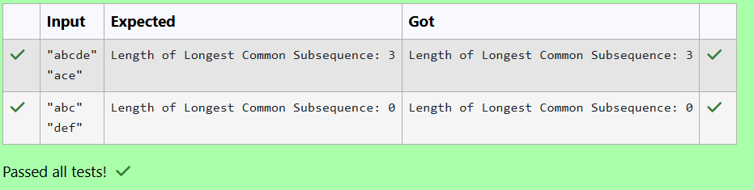

# EX 4D Longest Common SubSequence - Dynamic Programming.
## DATE: 28/10/2025
## AIM:
To write a Java program to for given constraints.
Given two strings text1 and text2, return the length of their longest common subsequence. If there is no common subsequence, return 0.
A subsequence of a string is a new string generated from the original string with some characters (can be none) deleted without changing the relative order of the remaining characters.

For example, "ace" is a subsequence of "abcde".
A common subsequence of two strings is a subsequence that is common to both strings.

Input: text1 = "abcde", text2 = "ace" 
Output: 3  
Explanation: The longest common subsequence is "ace" and its length is 3.
Constraints:

1 <= text1.length, text2.length <= 1000
text1 and text2 consist of only lowercase English characters.

## Algorithm
1. Start the program.
2. Create a DP table where dp[i][j] stores the LCS length between the first i characters of text1 and the first j characters of text2.
3. Fill the table: if characters match, set dp[i][j] = dp[i−1][j−1] + 1; otherwise choose the maximum from dp[i−1][j] or dp[i][j−1].
4. The value dp[m][n] gives the final LCS length between the two full strings. 
5. End the program.  

## Program:
```
/*
Program to implement Reverse a String
Developed by: HARINI R
Register Number: 212223100010 
*/

import java.util.Scanner;

public class Solution {
    public int longestCommonSubsequence(String text1, String text2) {    
        //ADD YOUR CODE HERE
        int m=text1.length();
        int n=text2.length();
        int[][] dp=new int[m+1][n+1];
        for(int i=1;i<=m;i++)
        {
            for(int j=1;j<=n;j++)
            {
                if(text1.charAt(i-1)==text2.charAt(j-1))
                {
                    dp[i][j]=dp[i-1][j-1]+1;
                }
                else
                {
                    dp[i][j]=Math.max(dp[i-1][j],dp[i][j-1]);
                }
            }
        }
        return dp[m][n];
    }

    // Main method for input and output
    public static void main(String[] args) {
        Scanner sc = new Scanner(System.in);
        Solution sol = new Solution();

        String text1 = sc.nextLine().replaceAll("\"", "");
        String text2 = sc.nextLine().replaceAll("\"", "");

        int lcsLength = sol.longestCommonSubsequence(text1, text2);
        System.out.println("Length of Longest Common Subsequence: " + lcsLength);

        sc.close();
    }
}
```

## Output:



## Result:
The program successfully implemented and the expected output is verified.
