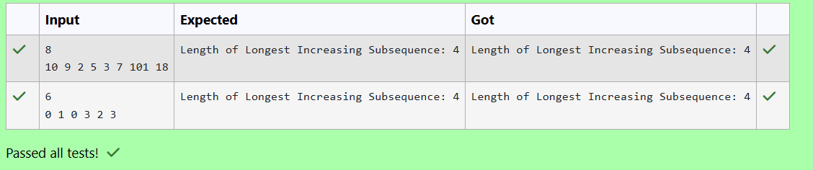

# EX 4E Longest Increasing Subsequence - Dynamic Programming.
## DATE: 30/10/2025
## AIM:
To write a Java program to for given constraints.
Given an integer array nums, return the length of the longest strictly increasing subsequence.
Example 1:
Input: nums = [10,9,2,5,3,7,101,18]
Output: 4
Explanation: The longest increasing subsequence is [2,3,7,101], therefore the length is 4.
## Algorithm
1. Start the program.
2. Maintain an array tails where tails[k] stores the smallest possible ending value of an increasing subsequence of length k+1.
3. For each number, use binary search on tails to find its correct position and replace or extend the subsequence.
4. The final size of tails represents the length of the longest increasing subsequence.
5. End the program.  

## Program:
```
/*
Program to implement Reverse a String
Developed by: HARINI R
Register Number: 212223100010 
*/

import java.util.*;

public class LongestIncreasingSubsequence {

    public static int lengthOfLIS(int[] nums) {
        // Type Your Code here...!
        if(nums==null || nums.length==0) return 0;
        int size=0;
        int[] tails=new int[nums.length];
        for(int i:nums)
        {
            int l=0,h=size;
            while(l<h)
            {
                int mid=l+(h-l)/2;
                if(tails[mid]<i)
                {
                    l=mid+1;
                }
                else
                {
                    h=mid;
                }
            }
            tails[l]=i;
            if(l==size) size++;
        }
        return size;
    }

public static void main(String[] args) {
        Scanner scanner = new Scanner(System.in);

        // Prompt user input
        int n = scanner.nextInt();
        int[] nums = new int[n];

        for (int i = 0; i < n; i++) {
            nums[i] = scanner.nextInt();
        }

        // Calculate and display the length of LIS
        int result = lengthOfLIS(nums);
        System.out.println("Length of Longest Increasing Subsequence: " + result);

        scanner.close();
    }
}
```

## Output:



## Result:
The program successfully implemented and the expected output is verified.
